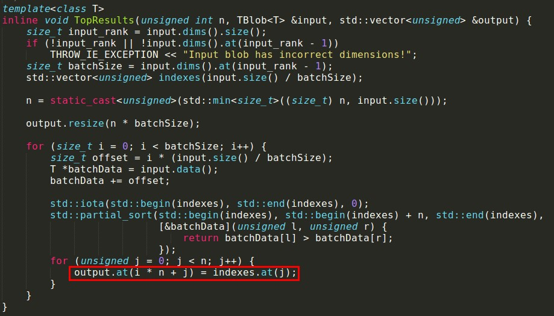

## reproduce

Model Optimizer in Intel OpenVINO can turn the original model prototxt file into xml file. When changing the last layer output dim as follow, it can make the program crash.

```xml
<layer id="65" name="prob" precision="FP32" type="SoftMax">
	<data axis="1"/>
	<input>
		<port id="0">
			<dim>1</dim>
			<dim>1000</dim>
			<dim>1</dim>
			<dim>1</dim>
		</port>
	</input>
	<output>
		<port id="1">
			<dim>1</dim>
			<dim>1500</dim>
			<dim>1</dim>
			<dim>1</dim>
		</port>
	</output>
</layer>
```

Then Inference Engine infer with the xml model file to output the result. 

[bad xml file](https://github.com/TiffanyBlue/PoCbyMyself/blob/master/Intel/openvino/bad-squeezenet1.1.xml)

## analysis

Changing the dim 1000 to 1050、1300... can cause buffer overflow and lead to read the out-of-bounds memory, even crash. 


The Inference Engine is a C++ library with a set of C++ classes to infer input data (images) and get a result. The C++ library provides an API to read the Intermediate Representation, set the input and output formats, and execute the model on devices. When the output size of last layer does not match the input and exceed allocated memory size, it will exceed the index of labels and read the out-of-bounds memory. 

For example, classifier program use caffe model squeezenet will call the `classificationResult.print()`to get result in file`/opt/intel/openvino_2019.1.144/deployment_tools/inference_engine/samples/common/samples/classification_results.h
`. 


It doesn't check the value of index to insure the dims correct and return the right label in file `/opt/intel/openvino_2019.1.144/deployment_tools/inference_engine/include/inference_engine.hpp`.



